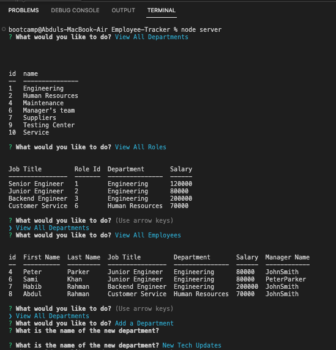
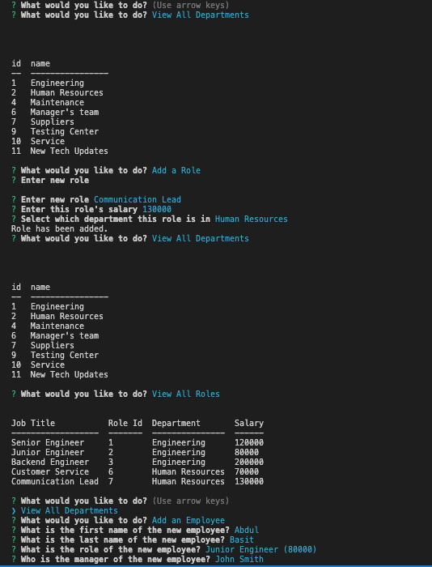
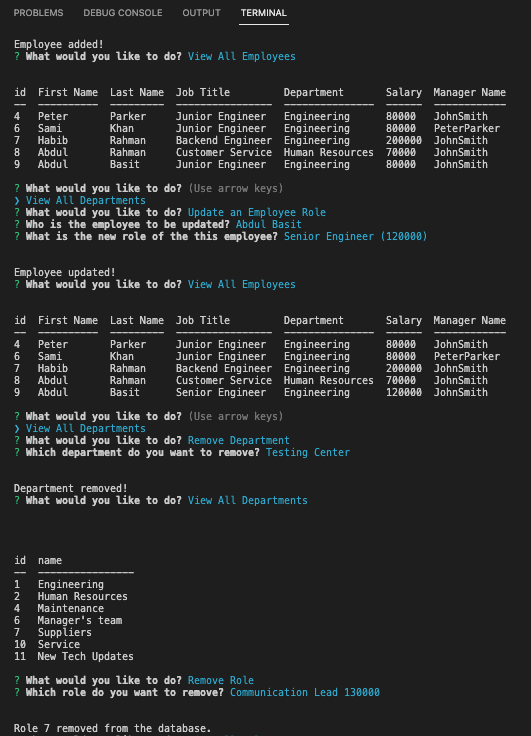
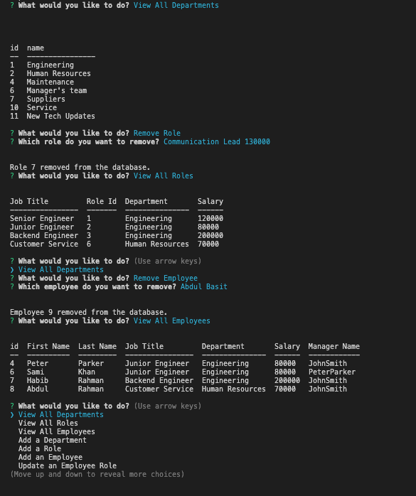

# Employee-Tracker

## A command-line application to manage a company's employee database, using Node.js, Inquirer, and MySQL.

## Demonstration
Link to video: https://drive.google.com/file/d/1UqEv67uXahDos06NrjN53d2togNvbthr/view

Screenshots: 

## Table of Contents
* [Description](#description)
* [Technologies](#technologies)
* [Instructions](#instructions)
* [License](#license)
* [Questions](#questions)

## Technologies
* MySQL
* Node.js
* Inquirer.js
* jQuery
* Javascript

## Instructions
For installantion, run < npm i > in the terminal.

After the dependencies have installed, create a .env file in which you will put the following:

DB_NAME = "employee_tracker_db"
DB_USER = < Your Username >
DB_PASSWORD = < Your Password >
 
Then, run < node server > in the terminal.

## License
This repository is not licensed.

## Questions
If you have any questions please contact me at [basitpk10@yahoo.com](mailto:basitpk10@yahoo.com).